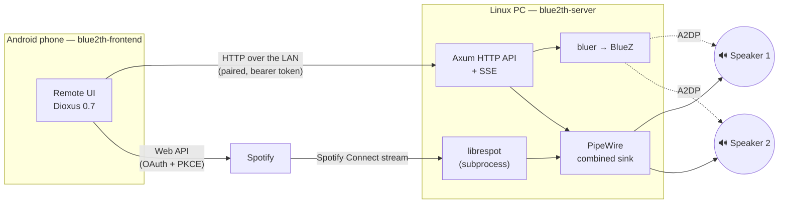

# blue2th

Play music on **two classic Bluetooth speakers at once**, from your phone.

Android will not send audio to two A2DP speakers from a third-party app, so
blue2th moves the audio engine to a Linux PC — BlueZ and PipeWire give it the
control the phone cannot have — and turns the phone into a remote. Spotify plays
through the PC as a Spotify Connect endpoint (via `librespot`), so nothing is
re-streamed from the phone: the audio goes from Spotify to the PC, then fans out to
both speakers.

## How it works



Three crates, one cargo workspace:

| Crate | Layer | Role |
|---|---|---|
| `blue2th-frontend` | mobile | The Android remote. Discovers backends over mDNS, pairs with a code or a QR, drives speakers and playback. Owns no Bluetooth of its own. |
| `blue2th-server` | server | The backend on the PC. Scans, connects and disconnects speakers through BlueZ, builds a PipeWire combined sink with a per-speaker latency offset, runs `librespot` as a child process. |
| `blue2th-proto` | proto | The serde types both sides speak. Target-agnostic, no platform dependency. |

The speakers pair with the **PC**, not the phone. The design and the reasons
behind it are in [`docs/ARCHITECTURE.md`](docs/ARCHITECTURE.md).

## Quick start

**On the Linux PC**

You need PipeWire, BlueZ, a Rust toolchain, and — for Spotify — [`librespot`](https://github.com/librespot-org/librespot)
on the `PATH` and a Spotify Premium account.

```bash
git clone https://github.com/tsbdtr/blue2th.git && cd blue2th
export BLUE2TH_SPOTIFY_CLIENT_ID=<your Spotify application's client id>   # Spotify only
cargo run --release -p blue2th-server -- --pair
```

The backend binds the PC's LAN address on port 4000, announces itself over mDNS,
and prints a six-character pairing code together with a QR code. A prebuilt
binary ships with each [release](https://github.com/tsbdtr/blue2th/releases) as
`blue2th-server-<version>-x86_64-linux-gnu.tar.gz`.

The Spotify client id comes from an application registered on the
[Spotify developer dashboard](https://developer.spotify.com/dashboard) with
`blue2th://spotify-callback` as its redirect URI. While that application is in
*Development mode*, the Spotify account you sign in with must be on its user
allowlist — otherwise playback fails with no visible error.

**On the phone**

Install `blue2th-<version>.apk` from the same release (Android 7.0 or later,
arm64). On first launch the app looks for backends on the Wi-Fi network; pick
yours, then scan the QR or type the code. Load the speakers, select one or two,
play. Each speaker has a latency offset you can adjust until the two are in step.

To build the app yourself, install [`dx`](https://dioxuslabs.com/learn/0.7/getting_started)
0.7 and the Android NDK, then `dx serve --platform android --package blue2th-frontend`
with a phone connected.

The longer versions: [`docs/INSTALL.md`](docs/INSTALL.md) for the backend, with
Spotify and a service unit, and [`docs/PAIRING.md`](docs/PAIRING.md) for the
phone, with what each status colour means and what to check when it does not
work.

## Status

**This is a working prototype**, built for one household: one PC, one phone,
two speakers, and validated on that hardware only. The audio path still drives
PipeWire through `pactl`, chosen for the prototype; the move to PipeWire's
native API is tracked in the v0.2.0 milestone. The interface is the prototype's
too, with a redesign under way. It does what it says; expect rough edges around
it.

Version 0.1.0. Everything the design describes is shipped and validated on
hardware: discovery, connection, playback to one speaker, fan-out to two,
Spotify. What remains is robustness work — reconnection, background reliability
on Android, speaker calibration.

Two things to know before relying on it:

- **Synchronisation is tunable, not perfect.** Classic A2DP gives two speakers no
  shared clock; the per-speaker offset compensates, and it is remembered per
  speaker.
- **Spotify support rides on `librespot`**, an unofficial client that needs a
  Premium account and can break when Spotify changes its protocol.

## Working on it

```bash
cargo fmt --check
cargo clippy --workspace --all-targets -- -D warnings -W clippy::unwrap_used -W clippy::expect_used -W clippy::panic -W clippy::todo -W clippy::unreachable -W clippy::unimplemented
cargo test --workspace
```

Plus `dx build --platform android --package blue2th-frontend` when the mobile
layer changed. `git config core.hooksPath .githooks` installs the same gates as
a pre-commit hook and a Conventional Commits check. Every change reaches
`develop` through a pull request; `main` only receives tagged deliveries, and
[`docs/RELEASING.md`](docs/RELEASING.md) says how a release is made and how to
verify one.

BlueZ, PipeWire and `librespot` are not testable in CI: the pure logic is
unit-tested, the hardware boundary is checked by hand. That is a stated
philosophy, not a gap.

**For contributors who use Claude or another coding assistant**: the repository
ships its own instructions. [`CLAUDE.md`](CLAUDE.md) holds the project's rules —
architecture, licence boundary, error handling, comment style, the pull-request
discipline — and the `/tdd` skill that runs the red/green/refactor cycle through
three agents in an isolated worktree. [`AGENTS.md`](AGENTS.md) is the Dioxus 0.7
reference the assistants read, since 0.7 changed every API. Reading `CLAUDE.md`
is worthwhile even without an assistant: it is where the reasons live.

## Licence

Dual-licensed under [MIT](LICENSE-MIT) or [Apache-2.0](LICENSE-APACHE), at your
option. `librespot` is GPL-3.0 and is deliberately run as a separate process,
never linked: that boundary is what allows this licence. Nothing in the
workspace may depend on it as a crate.
